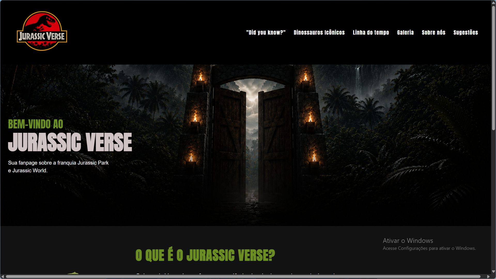
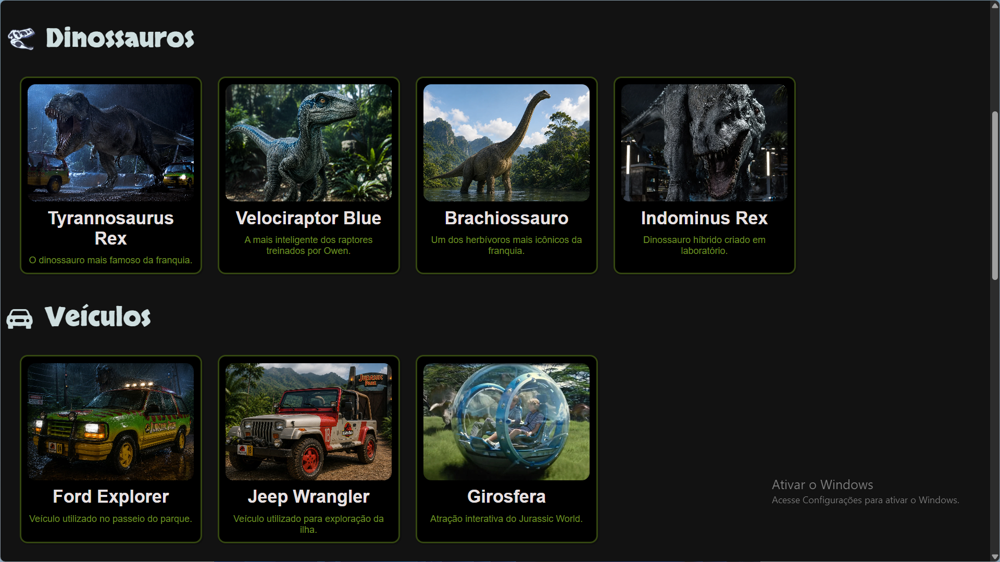
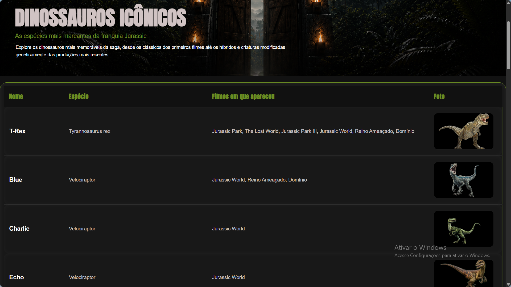
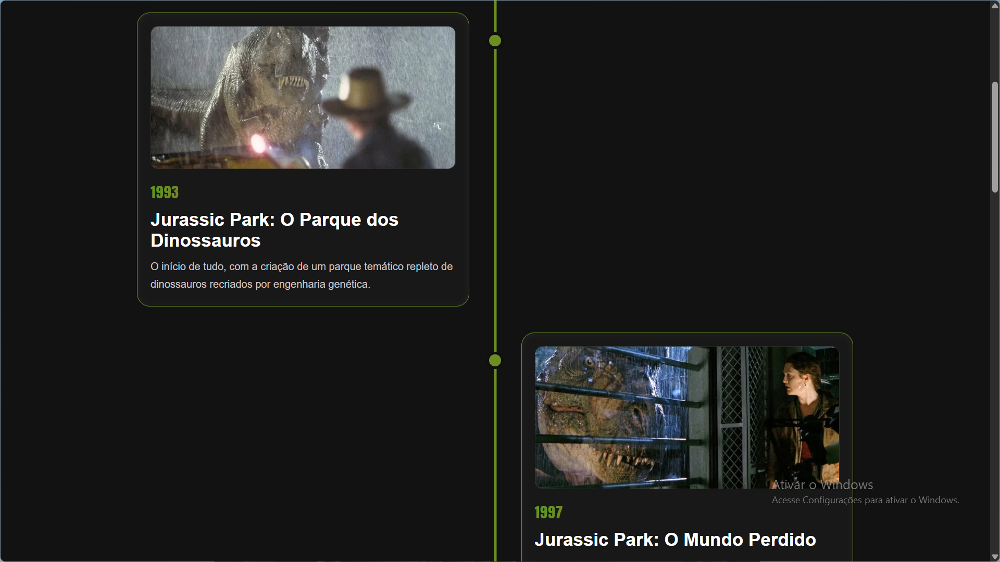
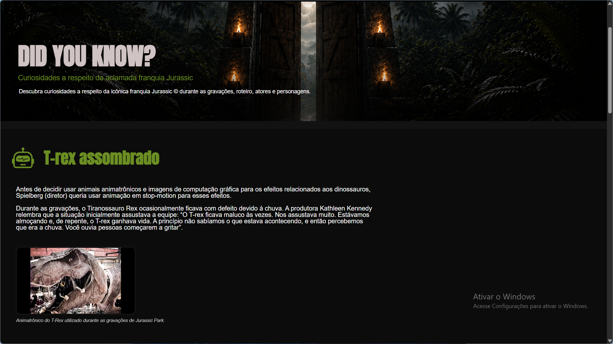
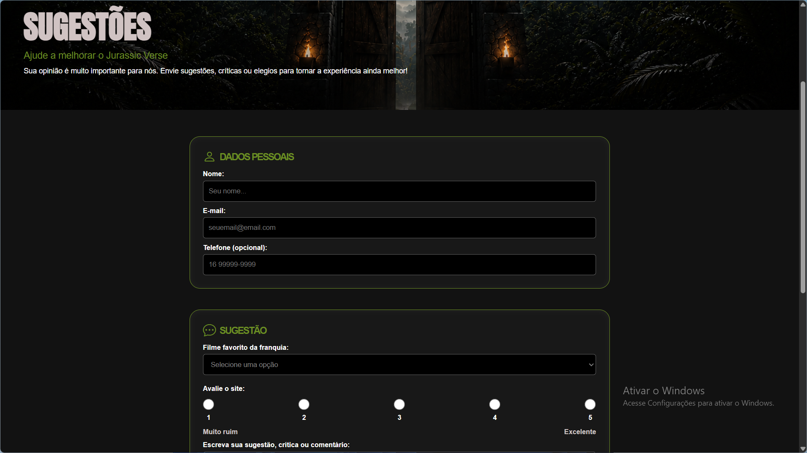
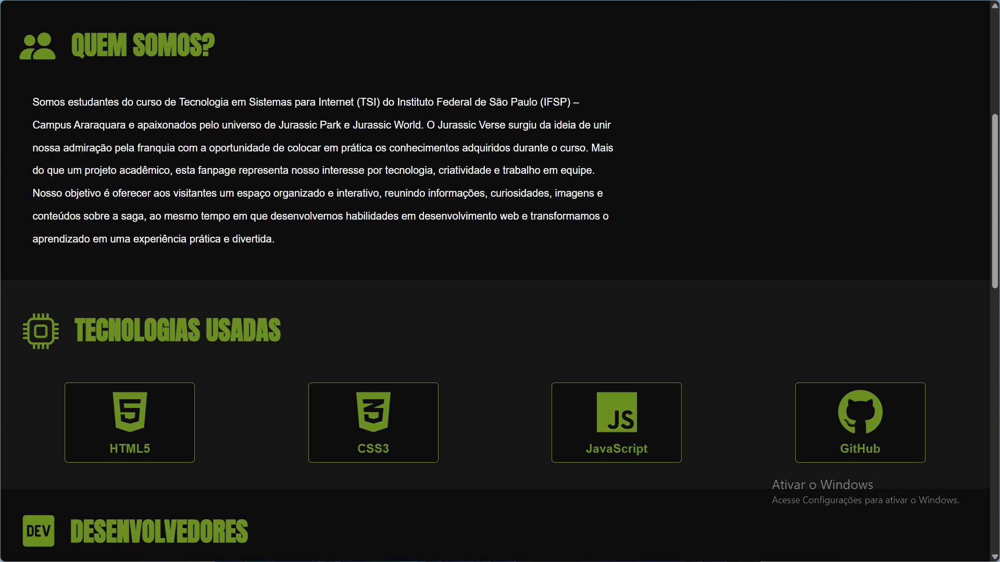

# 🦖 Jurassic Verse

<p align="center">
  
</p>

<p align="center">
  <strong>Uma fanpage inspirada nas franquias Jurassic Park e Jurassic World.</strong>
</p>

<p align="center">
  Projeto desenvolvido para a disciplina de <strong>Arquitetura e Desenvolvimento de Páginas Web (ARQIDPW)</strong>.
</p>

---

## 📖 Sobre o projeto

O **Jurassic Verse** é uma fanpage desenvolvida como projeto acadêmico com o objetivo de reunir informações, curiosidades e conteúdos sobre o universo de **Jurassic Park** e **Jurassic World**.

Durante o desenvolvimento, buscamos criar uma interface moderna, intuitiva e responsiva, aplicando boas práticas de HTML semântico, CSS e organização de código. Além disso, o projeto proporcionou uma experiência prática com Git e GitHub para versionamento e desenvolvimento em equipe.

---

## ✨ Funcionalidades

- 🏠 Página Inicial
- 🦖 Dinossauros Icônicos
- 🖼️ Galeria de Imagens
- 📅 Linha do Tempo da franquia
- 💡 Página "Did You Know?" com curiosidades
- 📝 Formulário de Sugestões
- 👥 Página Sobre Nós
- 📱 Layout Responsivo (Mobile First)

---

## 🛠️ Tecnologias Utilizadas

<p align="center">


</p>

---

# 📸 Capturas de Tela

## 🏠 Página Inicial

<p align="center">

</p>

---

## 🖼️ Galeria

<p align="center">

</p>

---

## 🦖 Dinossauros Icônicos

<p align="center">

</p>

---

## 📅 Linha do Tempo

<p align="center">

</p>

---

## 💡 Did You Know?

<p align="center">

</p>

---

## 📝 Sugestões

<p align="center">

</p>

---

## 👥 Sobre Nós

<p align="center">

</p>

---

# 📂 Estrutura do Projeto

```text
jurassic-verse/
│
├── css/
├── html/
├── img/
├── js/
├── screenshots/
│
├── index.html
└── README.md
```

---

# 👨‍💻 Desenvolvedores

| Nome | GitHub |
|------|--------|
| Pedro Aragoni | @pedroaragoni-dev |
| Mateus Calixto | @Caldev32 |

---

# 🌐 Demonstração

O projeto está disponível online através do GitHub Pages:

🔗 **Acesse aqui:** https://caldev32.github.io/jurassic-verse/

---

# 📚 Aprendizados

Durante o desenvolvimento deste projeto colocamos em prática conhecimentos sobre:

- HTML5 semântico
- CSS3
- Flexbox
- Responsividade com Media Queries
- Mobile First
- Organização de arquivos
- Git e GitHub
- Trabalho em equipe

---

# 📄 Licença

Este projeto foi desenvolvido exclusivamente para fins acadêmicos e de aprendizado, sem fins comerciais.
